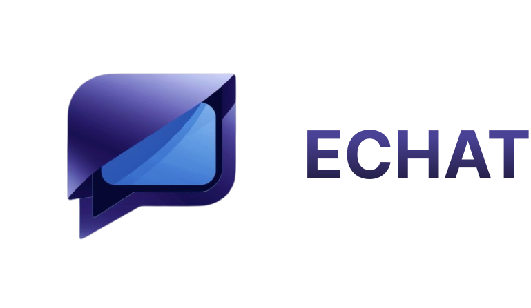
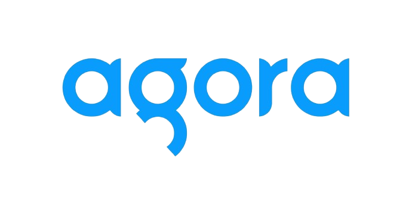
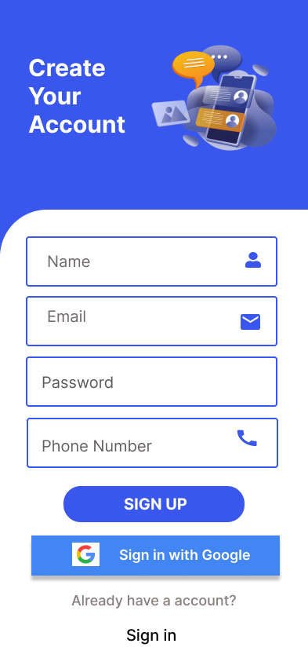
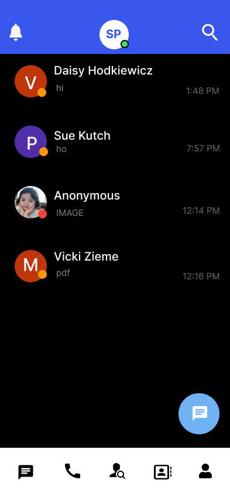
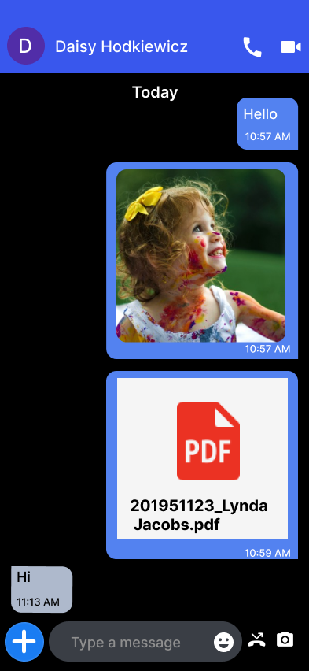
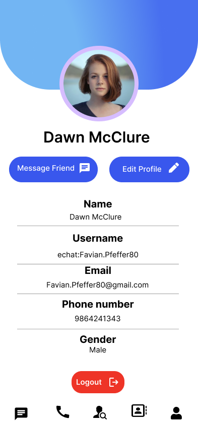
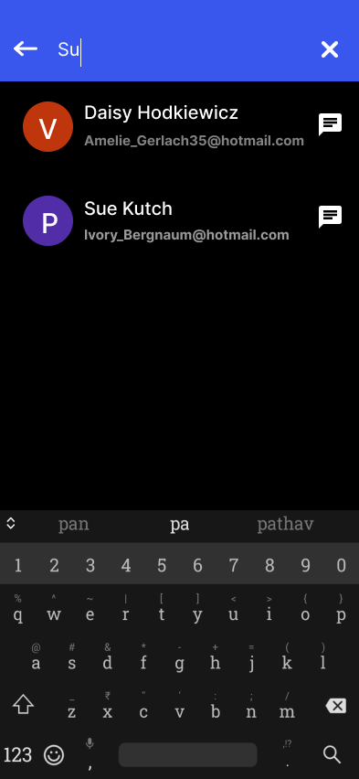

<!-- Project Title -->
<div align="center" style="display: flex; align-items: center; justify-content: center;">
  
</div>

**ECHAT** is a comprehensive chat application created using Flutter, Firebase, Dart, and Figma, offering a seamless communication experience.

### 🎥 Simple demo
<p align="center">
  
</p>

### 🔰 Project Description
- Created **ECHAT**, a robust chat application, leveraging Flutter, Firebase, Dart, and Figma, to provide users with an all-encompassing communication platform.
- Empowered with real-time messaging capabilities, supporting text, images, videos, and PDFs, facilitating seamless interaction between users.
- Ensured utmost user security and privacy by implementing secure authentication mechanisms via email and Google Integration.
- Integrated advanced voice and video calling functionalities using Agora SDK, allowing users to mute audio, disable video, and terminate calls as needed, enhancing the overall user experience.
- Implemented essential features including user search, profile management, contact inviting, and call/message history, to enhance usability and convenience.
- Optimized app performance through media caching techniques and reliable push notifications using cloud messaging, ensuring smooth and uninterrupted communication experiences.

---
### ➤ Key Features
- **Real-time Messaging**: Instant exchange of text, images, videos, and PDFs.
- **Secure Authentication**: Email and Google Integration for secure login.
- **Voice and Video Calling**: Real-time calls with mute, disable video, and call termination.
- **Optimized Performance**: Enhanced app performance with media caching and reliable push notifications.
- **Contact Invitations**: Invite contacts to join ECHAT for conversations.
- **Profile Editing**: Customize profiles with personal information and pictures.
- **Call Log Management**: View and delete call logs for control.
- **Search Functionality**: Easily discover and connect with other users.|

---
### 🛠 Technologies and Frameworks Used
-  Figma (for UI design)
-  Flutter Framework (Dart language)
-  Firebase (for Authentication And Storing Data)
-  Provider (for state management)
-  Agora SDK (for Video and voice calling)
-  Hive (for local storage)
-  SQLite (for local storage)

---
## ⚡Usage/Examples

```javascript
import 'package:flutter/material.dart';
void main() async {
  WidgetsFlutterBinding.ensureInitialized();
  await Firebase.initializeApp();
  runApp(MyApp());
}

//MyApp
class MyApp extends StatefulWidget {
  @override
  _MyAppState createState() => _MyAppState();
}
class _MyAppState extends State<MyApp> {
    Widget build(BuildContext context) {
        return MaterialApp(
            home: FutureBuilder(
                    future: authMethods.getCurrentUser(),
                    builder: (context, AsyncSnapshot<User?> snapshot) {
                    if (snapshot.hasData) {
                      return BotttomNavigationBar();
                    } else {
                      return isViewed != 0 ? OnBoardScreens() : Authenticate();
                    }
                  },
                ),
            );
    }
```
---

## 🚀 Installation

1. **Clone the repository:**

   ```bash
   git clone https://github.com/sahilpotdukhe/echat.git
2. **Navigate to the project directory:**
    ```bash
    cd echat
3. **Install dependencies:**
    ```bash
    flutter pub get
4. **Run the app:**
    ```bash
    flutter run

## 📋 Requirements

- Flutter SDK: [Installation Guide](https://flutter.dev/docs/get-started/install)
- Firebase Account: [Sign up for Firebase](https://firebase.google.com/)
- Agora Account: [Sign up for Agora](https://www.agora.io/en/)
- Figma Account: [Sign up for Figma](https://www.figma.com/)

---

##  App Design

<div align="center">
  <table style="border-collapse: collapse;">
    <tr>
      <td style="padding-right: 0px; border: none;">
        
        <p align="center">OnBoarding Screen</p>
      </td>
      <td style="padding-right: 0px; border: none;">
        
        <p align="center">SignUp Screen</p>
      </td>
      <td style="border: none;">
        
        <p align="center">ChatLists Screen</p>
      </td>
    </tr>
  </table>
</div>
<div align="center">
  <table style="border-collapse: collapse;">
    <tr>
      <td style="padding-right: 0px; border: none;">
        
        <p align="center">Conversations Screen</p>
      </td>
      <td style="padding-right: 0px; border: none;">
        
        <p align="center">Profile Screen</p>
      </td>
      <td style="border: none;">
        
        <p align="center">Search Screen</p>
      </td>
    </tr>
  </table>
</div>
<div align="center">
  <table style="border-collapse: collapse;">
    <tr>
      <td style="padding-right: 0px; border: none;">
        
        <p align="center">Pickup Screen</p>
      </td>
      <td style="padding-right: 0px; border: none;">
        
        <p align="center">VideoCall Screen</p>
      </td>
      <td style="border: none;">
        
        <p align="center">CallLogs Screen</p>
      </td>
    </tr>
  </table>
</div>

## 🤝 Contributing
Contributions are always welcome!
If you have a suggestion that would make this better, please fork the repo and create a pull request. Don't forget to give the project a star! Thanks again!
- Fork the Project
- Create your Feature Branch (```bash git checkout -b feature/AmazingFeature```)
- Commit your Changes (```bash git commit -m 'Add some AmazingFeature'```)
- Push to the Branch (```bash git push origin feature/AmazingFeature```)
- Open a Pull Request 


---
## ➤ Contact
You can reach out to me via the following methods:

- **Email:**  &nbsp;&nbsp;<a href="mailto:sahilpotdukhe.ssp@gmail.com">sahilpotdukhe.ssp@gmail.com
- **Social Media:**
   - &nbsp;&nbsp;[LinkedIn](https://www.linkedin.com/in/sahil-potdukhe/)
   - &nbsp;&nbsp;[GitHub](https://github.com/sahilpotdukhe)
   - &nbsp;&nbsp;[Instagram](https://www.instagram.com/sahilpotdukhe11/)
   - &nbsp;&nbsp;[Twitter](https://twitter.com/SahilPotdukhe)
  ---

This project underscores the power of modern technologies in creating a feature-rich and secure chat application tailored for today's communication needs.
